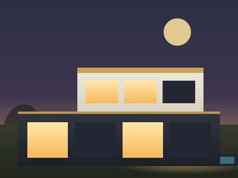

<div align="center">

# 🏡 خانه ایده‌آل | Khaneh Ideal

**قالب صفحه فرود برای مشاوران و آژانس‌های املاک — HTML/CSS/JS خالص، بدون فریم‌ورک**
### A production-ready real-estate agency landing page — pure HTML/CSS/JS, zero frameworks

[](#)
[](#)
[](#)
[](#)
[](LICENSE)
[](#)
[](#-contributing)

[دمو زنده](#) · [گزارش باگ](../../issues) · [درخواست ویژگی](../../issues)

</div>

<br>

<div align="center">
  
</div>

<br>

<table>
<tr>
<td width="70%">
  
</td>
<td width="30%">
  
</td>
</tr>
</table>

---

## 📋 فهرست مطالب

- [درباره پروژه](#-درباره-پروژه)
- [ویژگی‌ها](#-ویژگیها)
- [پیش‌نمایش سریع](#-پیشنمایش-سریع)
- [ساختار پروژه](#-ساختار-پروژه)
- [شروع سریع](#-شروع-سریع)
- [استقرار روی هاست (Deploy)](#-استقرار-روی-هاست-deploy)
- [سفارشی‌سازی](#-سفارشیسازی)
- [جایگزینی عکس‌های واقعی](#-جایگزینی-عکسهای-واقعی-ملک)
- [ریسپانسیو و بریک‌پوینت‌ها](#-ریسپانسیو-و-بریکپوینتها)
- [دسترس‌پذیری (Accessibility)](#-دسترسپذیری-accessibility)
- [سئو و متادیتا](#-سئو-و-متادیتا)
- [عملکرد (Performance)](#-عملکرد-performance)
- [پشتیبانی مرورگرها](#-پشتیبانی-مرورگرها)
- [نقشه راه](#-نقشه-راه)
- [مشارکت](#-contributing)
- [مجوز](#-مجوز)
- [قدردانی](#-قدردانی)

---

## 🧭 درباره پروژه

**خانه ایده‌آل** یک قالب صفحه فرود (Landing Page) کامل برای کسب‌وکارهای مشاور املاک است؛ شامل معرفی خدمات، نمایش املاک ویژه، فرآیند همکاری، نظرات مشتریان، سوالات متداول و فرم جستجو — همه با طراحی راست‌به‌چپ (RTL) و تایپوگرافی فارسی.

نقطه تمایز اصلی این پروژه نسبت به قالب‌های مشابه:

- **بدون فریم‌ورک، بدون build**: فقط HTML + CSS + JavaScript خالص. کافیست فایل‌ها را آپلود کنید.
- **بدون وابستگی به سرور شخص ثالث**: فونت فارسی (Vazirmatn) به‌صورت لوکال سرو می‌شود، تصاویر SVG برداری‌اند — یعنی هیچ بخشی از سایت به یک CDN یا API خارجی وابسته نیست و هرگز به‌خاطر قطعی یک سرویس بیرونی از کار نمی‌افتد.
- **آماده تولید (Production-ready)**: سئوی کامل (Open Graph، JSON-LD، sitemap)، دسترس‌پذیری استاندارد (WCAG-friendly)، و آزمایش‌شده روی ۱۳+ سایز صفحه مختلف.

## ✨ ویژگی‌ها

<table>
<tr>
<td valign="top" width="50%">

**رابط کاربری**
- ۱۰۰٪ راست‌به‌چپ (RTL) و بهینه برای فارسی
- فونت متغیر Vazirmatn (لوکال، بدون فراخوانی از گوگل‌فونت)
- کاملاً ریسپانسیو: موبایل کوچک تا دسکتاپ بزرگ
- انیمیشن‌های ظریف: اسکرول-ریویل پلکانی، شمارنده‌های متحرک، نوار پیشرفت اسکرول، اسلایدر جهت‌دار نظرات
- احترام کامل به `prefers-reduced-motion`

</td>
<td valign="top" width="50%">

**تعامل و عملکرد**
- کروسل املاک با پشتیبانی از لمس/اسکرول native
- آکاردئون سوالات متداول با `<details>` بومی (بدون جاوااسکریپت هم کار می‌کند)
- منوی موبایل، دکمه علاقه‌مندی، اسکرول به بالا
- بدون هیچ درخواست شبکه به سرویس‌های خارجی (فونت و آیکون‌ها لوکال)
- سبک و سریع: بدون کتابخانه اضافه، تصاویر SVG با وزن چند کیلوبایتی

</td>
</tr>
<tr>
<td valign="top" width="50%">

**سئو و متادیتا**
- تگ‌های Open Graph و Twitter Card
- داده ساختاریافته JSON-LD (`RealEstateAgent`)
- `sitemap.xml` و `robots.txt` آماده
- `site.webmanifest` برای نصب روی صفحه اصلی موبایل

</td>
<td valign="top" width="50%">

**دسترس‌پذیری**
- لینک Skip-to-content
- برچسب‌های `aria-*` مناسب برای عناصر تعاملی
- فوکوس قابل مشاهده با کیبورد (`:focus-visible`)
- کنتراست رنگ مطابق استاندارد و تارگت‌های لمسی حداقل ۳۲×۳۲ پیکسل

</td>
</tr>
</table>

## 🚀 پیش‌نمایش سریع

برای مشاهده لوکال، فقط `index.html` را در مرورگر باز کنید — نیازی به نصب چیزی نیست. برای تجربه کامل (بارگذاری صحیح فونت‌ها با CORS)، پیشنهاد می‌شود از یک سرور محلی ساده استفاده کنید:

```bash
# با پایتون (از قبل روی اکثر سیستم‌ها نصب است)
python3 -m http.server 8080

# یا با Node.js
npx serve .

# سپس در مرورگر باز کنید:
# http://localhost:8080
```

## 📁 ساختار پروژه

```
idealhome/
├── index.html                     صفحه اصلی
├── 404.html                       صفحه خطای ۴۰۴ سفارشی
├── robots.txt                     راهنمای خزنده‌های موتور جست‌وجو
├── sitemap.xml                    نقشه سایت برای سئو
├── site.webmanifest               متادیتای PWA (آیکون، رنگ تم و...)
├── LICENSE                        مجوز MIT
│
├── css/
│   └── style.css                  تمام استایل‌ها (بدون وابستگی خارجی)
│
├── js/
│   └── script.js                  منو، کروسل، آکاردئون، اسلایدر، انیمیشن‌های اسکرول
│
├── assets/
│   ├── fonts/
│   │   ├── vazirmatn-variable.woff2   فونت فارسی (لوکال، وزن‌های ۱۰۰ تا ۹۰۰)
│   │   └── OFL.txt                    مجوز فونت (SIL Open Font License)
│   │
│   └── img/
│       ├── logo-mark.svg
│       ├── favicon.svg / .ico / *.png
│       ├── hero-villa.svg             تصویر برداری ویلای هیرو
│       └── property-1.svg … property-6.svg
│
└── .github/
    └── screenshots/                تصاویر پیش‌نمایش برای این README
```

## ⚡ شروع سریع

```bash
# ۱. کلون کردن ریپازیتوری
git clone https://github.com/<your-username>/idealhome.git
cd idealhome

# ۲. اجرای سرور محلی
python3 -m http.server 8080

# ۳. باز کردن در مرورگر
open http://localhost:8080   # مک
# یا صرفاً به آدرس بالا در مرورگر خود بروید
```

هیچ `npm install`، هیچ فرآیند build و هیچ فایل پیکربندی‌ای در کار نیست — این یک پروژه کاملاً استاتیک است.

## 🌐 استقرار روی هاست (Deploy)

چون این پروژه کاملاً استاتیک است (بدون بک‌اند یا دیتابیس)، روی هر سرویسی قابل میزبانی است:

| روش | مراحل |
|---|---|
| **هاست اشتراکی / cPanel** | تمام فایل‌ها را داخل `public_html` آپلود کنید (FTP یا File Manager) |
| **GitHub Pages** | از تنظیمات ریپو → Pages → شاخه `main` را به‌عنوان منبع انتخاب کنید |
| **Netlify / Vercel / Cloudflare Pages** | ریپو را متصل کنید؛ چون build نیاز نیست، Publish directory را روی ریشه (`/`) بگذارید |

### ✅ چک‌لیست قبل از انتشار نهایی

- [ ] در `index.html`، مقادیر `og:url` و `canonical`، و در `robots.txt` / `sitemap.xml` دامنه واقعی خود را جایگزین `idealhome.ir` کنید
- [ ] شماره تلفن‌ها، ایمیل و آدرس در بخش «تماس با ما» و فوتر را به‌روزرسانی کنید
- [ ] لینک نقشه در فوتر (`https://maps.google.com/?q=...`) را با مختصات واقعی دفتر خود جایگزین کنید
- [ ] عکس‌های SVG را در صورت تمایل با عکس‌های واقعی ملک جایگزین کنید ([راهنما](#-جایگزینی-عکسهای-واقعی-ملک))
- [ ] فرم جستجو را به یک بک‌اند واقعی وصل کنید (پایین توضیح داده شده)

## 🎨 سفارشی‌سازی

### رنگ‌ها و توکن‌های طراحی

تمام رنگ‌ها، شعاع گوشه‌ها و سایه‌ها به‌صورت متغیرهای CSS در ابتدای `css/style.css` تعریف شده‌اند — کافیست این بخش را ویرایش کنید تا کل سایت به‌روزرسانی شود:

```css
:root{
  --gold:#c9a25c;        /* رنگ طلایی اصلی برند */
  --gold-dark:#a9803f;   /* طلایی تیره (هاور و تاکید) */
  --dark:#191a1e;        /* رنگ تیره (هدر، فوتر، دکمه‌ها) */
  --cream-1:#fdfbf6;     /* پس‌زمینه روشن اصلی */
  --text:#20222a;        /* رنگ متن اصلی */
  --container:1220px;    /* حداکثر عرض محتوا */
  --font:'Vazirmatn', 'Tahoma', sans-serif;
}
```

### متن‌ها و محتوا

تمام متن‌های سایت مستقیماً در `index.html` نوشته شده‌اند (بدون سیستم i18n یا CMS) — با جست‌وجوی متن مورد نظر در فایل، آن را ویرایش کنید.

### فرم جستجو

فرم جستجو (`#searchForm` در `index.html`) در حال حاضر فقط به بخش املاک اسکرول می‌کند. برای اتصال به یک API واقعی، رویداد `submit` مربوطه را در `js/script.js` پیدا کرده و منطق فراخوانی API خود را جایگزین کنید.

## 🖼 جایگزینی عکس‌های واقعی ملک

به‌جای هات‌لینک کردن عکس از سرورهای شخص ثالث (که ریسک شکستن لینک و مالکیت معنوی نامشخص دارد)، تصاویر این قالب به‌صورت گرافیک برداری SVG طراحی شده‌اند: سبک، بدون وابستگی بیرونی و همیشه شارپ. برای جایگزینی با عکس واقعی ملک‌های خودتان:

1. عکس را در پوشه `assets/img/` قرار دهید (پیشنهاد: نسبت ۴:۳، حداکثر عرض ۸۰۰px، فرمت `webp` یا `jpg` فشرده زیر ۲۰۰ کیلوبایت)
2. مسیر `src` تگ `` مربوطه را در `index.html` به‌روزرسانی کنید:

```html
<!-- قبل -->


<!-- بعد -->

```

## 📱 ریسپانسیو و بریک‌پوینت‌ها

طراحی روی بیش از ۱۳ سایز صفحه (از ۳۲۰ تا ۱۴۴۰ پیکسل) تست شده است — از کوچک‌ترین گوشی‌های موجود تا دسکتاپ‌های بزرگ:

| بریک‌پوینت | دستگاه هدف |
|---|---|
| `≤ 400px` | گوشی‌های خیلی کوچک (iPhone SE و مشابه) |
| `≤ 480px` | گوشی‌های استاندارد |
| `≤ 680px` | گوشی‌های بزرگ / فبلت |
| `≤ 820px` | تبلت پرتره (iPad mini/Air) |
| `≤ 992px` | تبلت لندسکیپ |
| `≤ 1180px` | لپ‌تاپ‌های کوچک |
| `> 1180px` | دسکتاپ استاندارد |

نکات فنی رعایت‌شده برای تجربه موبایل بدون نقص:

- بدون اسکرول افقی در هیچ‌کدام از بریک‌پوینت‌ها
- تمام تارگت‌های لمسی حداقل ۳۲×۳۲ پیکسل
- فونت فیلدهای فرم حداقل ۱۶px (برای جلوگیری از زوم خودکار سافاری iOS)
- کروسل با `scroll-snap` و پشتیبانی swipe؛ فلش‌های ناوبری در موبایل مخفی می‌شوند (رفتار native جایگزین می‌شود)

## ♿ دسترس‌پذیری (Accessibility)

- ساختار معنایی HTML5 (`<header>`, `<main>`, `<nav>`, `<footer>`)
- لینک «رفتن به محتوای اصلی» برای کاربران کیبورد/صفحه‌خوان
- تمام آیکون‌های تزئینی با `aria-hidden="true"` از صفحه‌خوان مخفی شده‌اند
- آکاردئون سوالات متداول با تگ بومی `<details>/<summary>` — کاملاً در دسترس و حتی بدون جاوااسکریپت هم کار می‌کند
- تمام انیمیشن‌ها به `prefers-reduced-motion: reduce` احترام می‌گذارند

## 🔍 سئو و متادیتا

- متا تگ‌های کامل `description`، `Open Graph` و `Twitter Card`
- داده ساختاریافته [JSON-LD](https://schema.org/RealEstateAgent) برای موتورهای جست‌وجو
- `sitemap.xml` و `robots.txt` آماده استفاده
- برچسب `canonical` (پیش از انتشار، دامنه واقعی را جایگزین کنید)

## ⚙️ عملکرد (Performance)

- بدون هیچ کتابخانه یا فریم‌ورک خارجی — فقط HTML/CSS/JS خام
- فونت با `font-display: swap` و `preload` برای جلوگیری از پرش محتوا (CLS)
- تمام تصاویر SVG (چند کیلوبایت در مقابل چند صد کیلوبایت عکس معمولی)
- بارگذاری تنبل (`loading="lazy"`) برای تصاویر ملک‌های زیر صفحه اول

## 🌍 پشتیبانی مرورگرها

آخرین دو نسخه مرورگرهای زیر به‌طور کامل پشتیبانی می‌شوند:

Chrome · Edge · Firefox · Safari (دسکتاپ و iOS) · Android WebView

> از ویژگی‌های مدرن CSS مثل `:focus-visible`، فونت‌های متغیر (Variable Fonts) و `scroll-snap` استفاده شده که در مرورگرهای خیلی قدیمی (نظیر IE11) پشتیبانی نمی‌شوند.

## 🗺 نقشه راه

- [ ] اتصال فرم جستجو به یک API واقعی فیلتر ملک
- [ ] صفحه اختصاصی جزئیات هر ملک
- [ ] پنل مدیریت محتوا (افزودن/ویرایش ملک بدون دست‌زدن به کد)
- [ ] حالت تیره (Dark Mode)
- [ ] چندزبانه (فارسی/انگلیسی) با سوییچر زبان

پیشنهاد ویژگی جدید دارید؟ یک [Issue](../../issues) باز کنید.

## 🤝 Contributing

مشارکت شما باعث خوشحالی است! برای مشارکت:

1. این ریپازیتوری را Fork کنید
2. یک شاخه جدید بسازید (`git checkout -b feature/awesome-feature`)
3. تغییرات خود را Commit کنید (`git commit -m 'Add awesome feature'`)
4. شاخه را Push کنید (`git push origin feature/awesome-feature`)
5. یک Pull Request باز کنید

لطفاً پیش از ارسال PR، تغییرات را حداقل در یکی از سایزهای موبایل، تبلت و دسکتاپ تست کنید.

## 📄 مجوز

این پروژه تحت مجوز **MIT** منتشر شده است — فایل [LICENSE](LICENSE) را ببینید.

> توجه: این مجوز فقط کد اصلی سایت (HTML/CSS/JS و تصاویر SVG دست‌ساز) را پوشش می‌دهد. فونت Vazirmatn جداگانه تحت [SIL Open Font License 1.1](assets/fonts/OFL.txt) منتشر شده است.

## 🙏 قدردانی

- فونت فارسی [Vazirmatn](https://github.com/rastikerdar/vazirmatn) — طراحی صابر راستی‌کردار
- آیکون‌ها به‌صورت SVG دست‌ساز و اختصاصی برای این پروژه

---

<div align="center">

ساخته‌شده با ♥ برای جامعه توسعه‌دهندگان فارسی‌زبان

اگر این پروژه برایتان مفید بود، یک ⭐ فراموش نشود!

</div>
